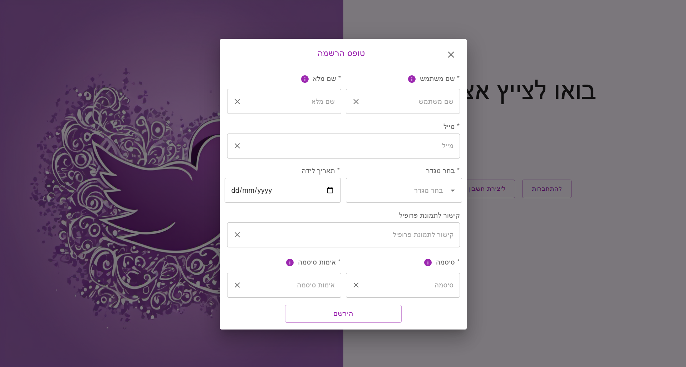
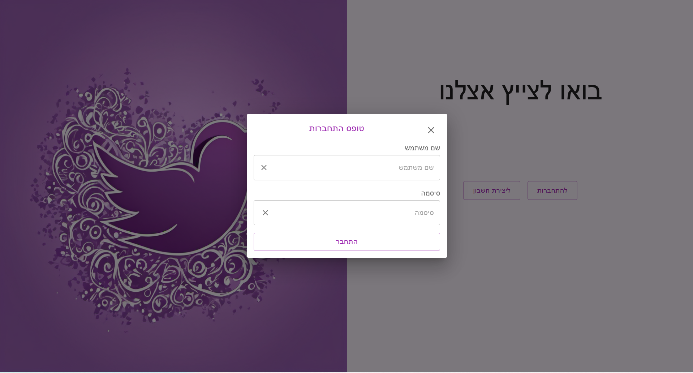
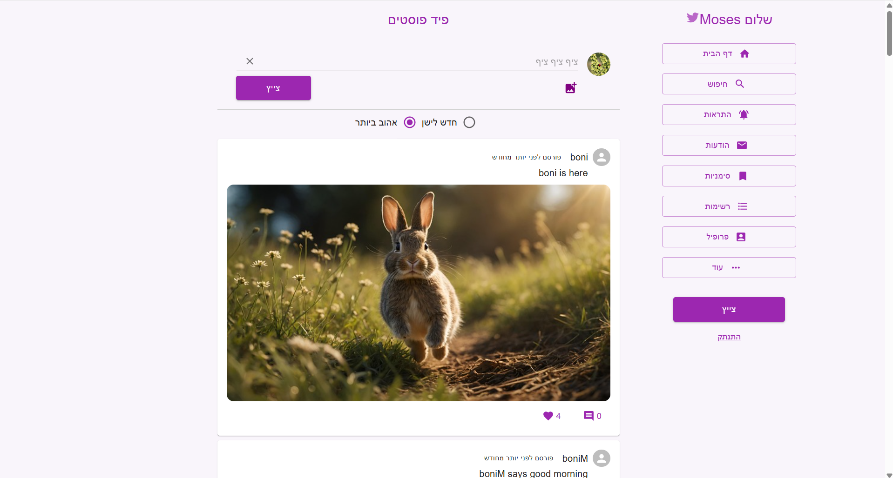
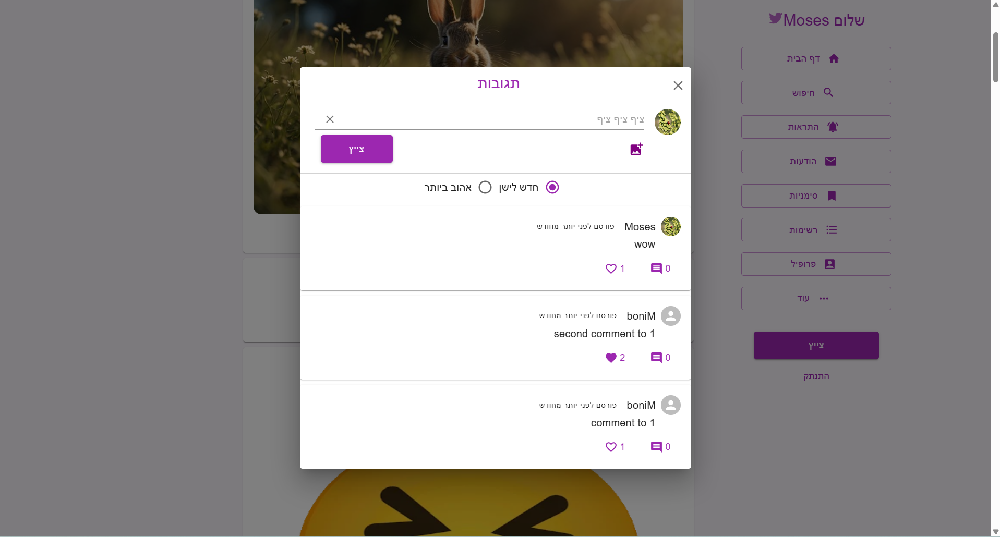
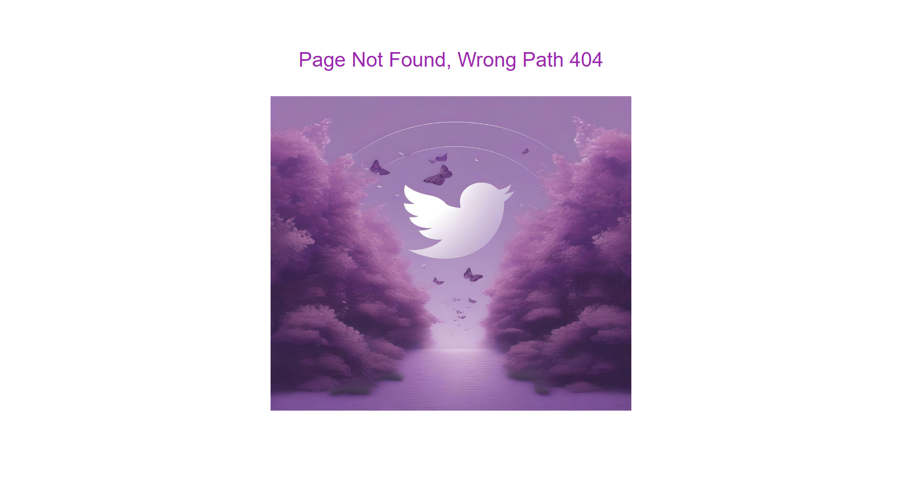

# Twitter (Onboarding Project)

> This project was developed as part of my onboarding at **Matzpen Unit** and is no longer maintained or updated.

---

## 📜 Description

A simplified full-stack **Twitter-like application** built during onboarding.  
The app provides basic social features such as user authentication, tweet/like/comment a post, and viewing posts.  
It was developed for learning and demonstration purposes only and is not deployed (the database runs locally via pgAdmin and PostgreSQL).

---

## 🧰 Tech Stack

**Frontend:** React.js, TypeScript, Material UI, typescript-cookie  
**Backend:** Node.js, TypeScript, Express.js  
**Database:** PostgreSQL (via pgAdmin)  
**Authentication:** JWT-based (JSON Web Tokens)  

---

## ⚙️ Functionality

- **Register & Login** – Users can create an account and log in securely using JWT authentication.  
- **Dashboard** – After login, users see a feed containing all posts.  
- **Create Post** – Users can publish posts with text and optionally add an image or a GIF.  
- **Like / Unlike Posts** – Each post can be liked or unliked by logged-in users.  
- **Comments** – Users can comment on existing posts.  
- **Logout** – Securely end the session.

---

## 🖼️ Screenshots

### Home Page

### Register Page

### Login Page

### Feed

### Comments

### Page Not Found

---

## 🚧 Project Status

This was an onboarding project and is no longer maintained or updated.
The code remains available for reference and learning purposes.

---

## 👤 Author

Created by Lilach Rabinovich as part of onboarding at Matzpen Unit.
